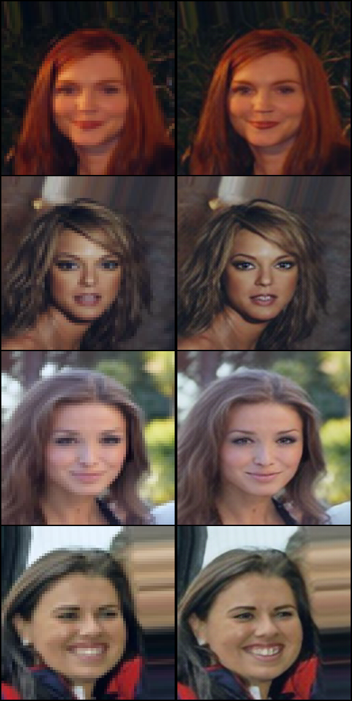

<p align="center"></p>

## PyTorch-GAN-ESRGAN
TO DO.

<b>See also:</b> [Keras-GAN](https://github.com/eriklindernoren/Keras-GAN)

## Table of Contents
  * [Installation](#installation)
  * [Implementations](#implementations)
    + [Enhanced Super-Resolution GAN](#enhanced-super-resolution-gan)

## Installation
    $ git clone https://github.com/eriklindernoren/PyTorch-GAN
    $ cd PyTorch-GAN/
    $ sudo pip3 install -r requirements.txt

## Implementations
### Enhanced Super-Resolution GAN
_ESRGAN: Enhanced Super-Resolution Generative Adversarial Networks_

#### Authors
Xintao Wang, Ke Yu, Shixiang Wu, Jinjin Gu, Yihao Liu, Chao Dong, Chen Change Loy, Yu Qiao, Xiaoou Tang

#### Abstract
The Super-Resolution Generative Adversarial Network (SRGAN) is a seminal work that is capable of generating realistic textures during single image super-resolution. However, the hallucinated details are often accompanied with unpleasant artifacts. To further enhance the visual quality, we thoroughly study three key components of SRGAN - network architecture, adversarial loss and perceptual loss, and improve each of them to derive an Enhanced SRGAN (ESRGAN). In particular, we introduce the Residual-in-Residual Dense Block (RRDB) without batch normalization as the basic network building unit. Moreover, we borrow the idea from relativistic GAN to let the discriminator predict relative realness instead of the absolute value. Finally, we improve the perceptual loss by using the features before activation, which could provide stronger supervision for brightness consistency and texture recovery. Benefiting from these improvements, the proposed ESRGAN achieves consistently better visual quality with more realistic and natural textures than SRGAN and won the first place in the PIRM2018-SR Challenge. The code is available at [this https URL](https://github.com/xinntao/ESRGAN).

[[Paper]](https://arxiv.org/abs/1809.00219) [[Code]](implementations/esrgan/esrgan.py)


#### Run Example
```
$ cd implementations/esrgan/
<follow steps at the top of esrgan.py>
$ python3 esrgan.py
```

<p align="center">
    
</p>
<p align="center">
    Nearest Neighbor Upsampling | ESRGAN
</p>